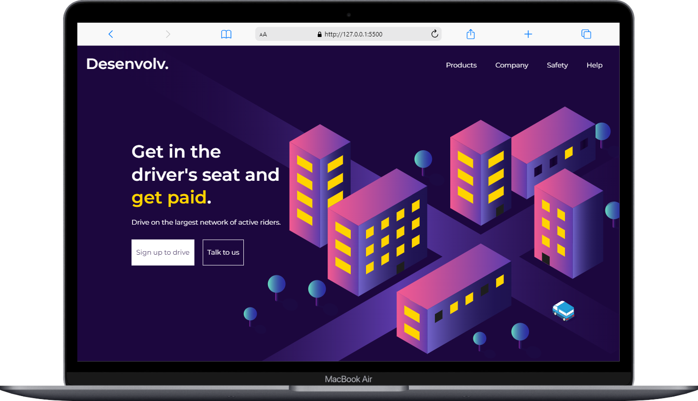

Projeto de Página Web com Sass
Este é um projeto de página web que utiliza HTML, CSS e Sass. O objetivo é criar uma interface de usuário simples e responsiva.

Estrutura do Projeto
index.html: Arquivo principal que contém a estrutura HTML da página.
css/styles.css: Arquivo CSS gerado a partir dos arquivos Sass, que define o estilo da página.
sass/: Diretório contendo os arquivos Sass (.scss).
images/: Diretório para imagens e ícones utilizados na página.

